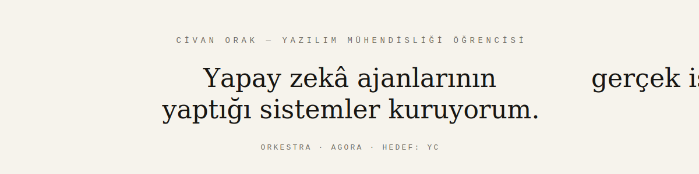
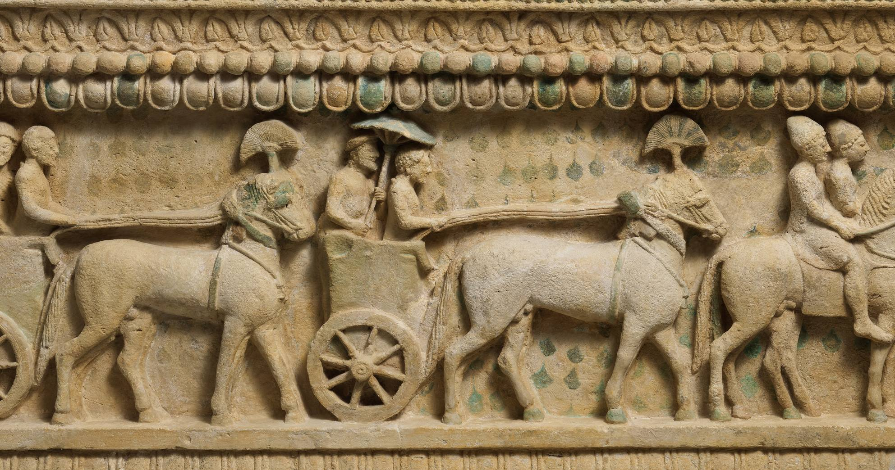

  
  

&nbsp;

`/ 01 — KİMİM`

Merhaba, ben Civan. Yazılım mühendisliği üçüncü sınıf öğrencisiyim ve iki üretim seviyesinde yapay zekâ sistemini tek başıma geliştiriyorum. Yapay zekânın demo üretmesiyle değil, **iş üretmesiyle** ilgileniyorum: kurduğum sistemlerde ajanlar siteleri tarıyor, ölçüyor, birbirlerinin çıktısını denetliyor ve her sayının kaynağını göstermek zorunda olduğu raporlar hazırlıyor.

&nbsp;

`/ 02 — SEÇİLİ SİSTEMLER`

### [Orkestra](https://github.com/civanorak/AutonomousAgentCorporation)

E-ticaret sitelerini uçtan uca denetleyip kanıta dayalı iş raporları üreten 14 ajanlı bir sistem. Rapordaki her sayı ya kaynağını gösteriyor ya da "tahmin" olarak etiketleniyor; deterministik lint ile LLM hakemden oluşan çift katmanlı eleştirmen onaylamadan hiçbir rapor yayınlanmıyor.

`1.837 geçen test` · `14 ajanlık kadro` · `50+ API endpoint'i`

Python · FastAPI · SQLite · Ollama + Anthropic · React · SSE

### [Agora](https://github.com/civanorak/AGORA)

E-ticaret sitelerini yakında insanlardan çok yapay zekâ ajanları ziyaret edecek. Agora gelen her isteği yedi karar sınıfından birine ayırıyor — her karar güven puanı ve kanıt listesiyle geliyor — ve mağazalar için barındırmaya hazır `/llms.txt` üretiyor.

`7 karar sınıfı` · `gerçek zamanlı ASGI toplayıcı` · `üretilmiş /llms.txt`

Python · FastAPI · aiosqlite · React · Vite · TypeScript

&nbsp;

`/ 03 — NASIL ÇALIŞIYORUM`

Çok-ajanlı bir geliştirme akışıyla çalışıyorum: **mimar**, **kodlayıcı** ve **denetçi** rollerini ayrı yapay zekâ örneklerine dağıtıyorum ve hepsini tek bir doğruluk kaynağı olan spesifikasyona bağlıyorum. Her değişiklik test yazmayı zorunlu kılıyor; hiçbir şey milestone kapısından geçmeden ana dala giremiyor.

Python · C# · Java · C/C++ · SQL (Microsoft SQL Server) · FastAPI · React · TypeScript · Playwright · Git

&nbsp;

`/ 04 — KATKI GRAFİĞİ`

  

&nbsp;

`/ 05 — İLETİŞİM`

**[Portfolio](https://portfolio-six-iota-ro8cj8jhcx.vercel.app)** · [LinkedIn](https://www.linkedin.com/in/civanorak) · [orakcivan07@gmail.com](mailto:orakcivan07@gmail.com)

Friz: Amathus lahdi (detay), Kıbrıs, MÖ 5. yüzyıl — The Metropolitan Museum of Art, Open Access (CC0).
